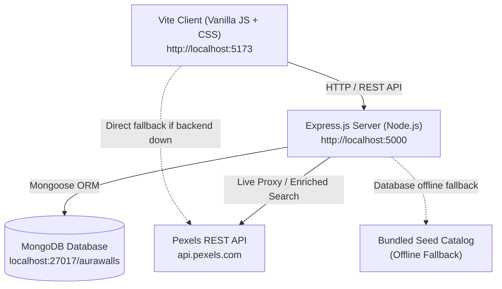

# ❖ AuraWalls — 4K & Mobile Wallpaper Studio

> A high-performance, full-stack MERN application for exploring, previewing on real-time device mockups, and downloading ultra-high-definition wallpapers for mobile and desktop displays.

---

## 📋 Table of Contents
- [Overview](#overview)
- [Key Features](#key-features)
- [Architecture & Tech Stack](#architecture--tech-stack)
- [Project Directory Structure](#project-directory-structure)
- [Getting Started](#getting-started)
  - [Prerequisites](#prerequisites)
  - [Installation](#installation)
  - [Environment Variables](#environment-variables)
  - [Running the Application](#running-the-application)
- [REST API Reference](#rest-api-reference)
- [Data Models (MongoDB)](#data-models-mongodb)
- [Frontend Components & Services](#frontend-components--services)
- [Offline & Graceful Fallback Strategy](#offline--graceful-fallback-strategy)
- [Scripts Reference](#scripts-reference)

---

## 🌟 Overview

**AuraWalls** combines curated visual artistry with a live device mockup simulator. Users can browse portrait wallpapers designed for smartphone screens (9:16) and landscape wallpapers tailored for desktop displays (16:9), preview how they look in real-time inside realistic iPhone 15 Pro, iPad, and MacBook/Desktop hardware frames, tweak live AMOLED/Cyber visual filters, and download wallpapers in multiple resolutions (4K UHD, QHD+, 1080p, and Original).

The system operates in a **dual-source architecture**: it connects directly to the **Pexels API** for live global search and curation, while maintaining an offline-first **MongoDB** database and bundled local catalogue fallback.

---

## ✨ Key Features

1. **Live Device Mockup Simulator**:
   - **Mobile Frame**: iPhone 15 Pro with Dynamic Island, live real-time ticking clock, date, and toggleable Lock Screen vs. Home Screen app grid.
   - **Tablet Frame**: iPad display with split widgets and clock.
   - **Desktop Frame**: MacBook / Desktop monitor frame with clean mode or floating macOS window preview.
   - **Visual Filters**: Real-time CSS filters: AMOLED High Contrast, Cyberpunk Neon, Film Warmth, Noir Monochrome, and Background Blur.
   - **Custom Clock Customization**: Switchable clock typography (*Outfit*, *Serif*, *Monospace*, *Rounded*) and custom clock colors.

2. **Dual-Display Orientation Support**:
   - **Mobile (9:16 portrait)**: Tailored for smartphones with QHD+ resolution indicators.
   - **Desktop (16:9 landscape)**: Tailored for ultrawide and 4K displays.
   - **All Displays**: Seamless grid mixing portrait and landscape formats.

3. **Multi-Tier Download Engine**:
   - Download in Original Full Resolution, 4K UHD (`3840x2160`), 2K QHD (`2560x1440`), or Mobile FHD (`1080x1920`).
   - Automated download tracking and analytics logging.

4. **Category & Color Swatch Filtering**:
   - 12 curated categories: *Minimalist, AMOLED, Cyberpunk, Nature, Space, Abstract, Anime, Architecture, Cars, Dark, Neon, Gradient*.
   - Color swatch picker for filtering wallpapers by dominant hue.

5. **Favorites Sync**:
   - Instant optimistic toggle on the client with `localStorage` persistence.
   - Synchronized with MongoDB backend when online.

6. **Pexels API Integration**:
   - Built-in support for live Pexels search and curated photo feeds.
   - In-app API Key modal for custom user keys with instant verification.

---

## 🏗️ Architecture & Tech Stack



### Technology Highlights

| Layer | Technologies |
|---|---|
| **Frontend** | Vanilla ES Modules JavaScript, Vite 8, Custom Glassmorphism CSS |
| **Typography** | Google Fonts (*Outfit*, *Plus Jakarta Sans*, *JetBrains Mono*) |
| **Backend** | Node.js, Express.js 5, CORS, Dotenv |
| **Database** | MongoDB with Mongoose 9 |
| **External API** | Pexels API (v1 Curated & Search) |

---

## 📁 Project Directory Structure

```text
Antigravity_workspace/
├── index.html                   # Main HTML5 application shell & layout
├── package.json                 # Project dependencies & npm scripts
├── .env                         # Server & client environment configuration
├── .env.example                 # Example template for environment variables
├── server/                      # Node.js Express backend
│   ├── server.js                # Server entrypoint & middleware setup
│   ├── config/
│   │   └── db.js                # MongoDB connection handler with fallback
│   ├── controllers/
│   │   ├── wallpaperController.js # Curated & search logic, download logging
│   │   ├── favoriteController.js  # Favorites CRUD handlers
│   │   └── pexelsController.js     # API key verification & proxy helpers
│   ├── models/
│   │   ├── Wallpaper.js         # Mongoose schema for wallpapers
│   │   ├── Favorite.js          # Mongoose schema for user favorites
│   │   └── DownloadLog.js       # Mongoose schema for download analytics
│   ├── routes/
│   │   ├── wallpaperRoutes.js   # /api/wallpapers routes
│   │   ├── favoriteRoutes.js    # /api/favorites routes
│   │   └── pexelsRoutes.js      # /api/pexels routes
│   └── data/
│       └── seedData.js          # Curated initial catalog for database seeding
├── src/                         # Frontend client source code
│   ├── main.js                  # Main client Application Controller & state
│   ├── style.css                # Glassmorphic CSS design system
│   ├── components/
│   │   ├── deviceMockup.js      # Live iPhone, iPad & Mac mockup simulator
│   │   ├── modal.js             # Detailed wallpaper inspector modal
│   │   ├── wallpaperCard.js     # Responsive wallpaper card component
│   │   ├── apiKeyModal.js       # Pexels API key management dialog
│   │   └── toast.js             # Floating toast notification manager
│   ├── services/
│   │   ├── backendApi.js        # REST client communicating with Express server
│   │   ├── pexelsService.js     # Direct Pexels service with caching
│   │   └── storageService.js    # LocalStorage & database sync layer
│   └── data/
│       └── curatedWallpapers.js # Curated client catalog and category metadata
└── public/                      # Static assets & favicons
```

---

## 🚀 Getting Started

### Prerequisites

- **Node.js**: `v18.0.0` or higher
- **npm**: `v9.0.0` or higher
- **MongoDB** *(Optional)*: Local MongoDB instance at `mongodb://127.0.0.1:27017` or MongoDB Atlas URI. *(The server automatically falls back to bundled data if MongoDB is offline).*

### Installation

Clone the repository and install dependencies:

```bash
npm install
```

### Environment Variables

Create a `.env` file in the project root:

```ini
PORT=5000
MONGODB_URI=mongodb://127.0.0.1:27017/aurawalls
PEXELS_API_KEY=your_pexels_api_key_here
CLIENT_URL=http://localhost:5173
```

> **Note**: Even without a `PEXELS_API_KEY`, the application works out-of-the-box using the high-definition curated catalog.

### Running the Application

To run both the **Express API** and the **Vite Client** concurrently:

```bash
npm run dev
```

- **Frontend**: [http://localhost:5173](http://localhost:5173)
- **Backend API**: [http://localhost:5000](http://localhost:5000)

---

## 📡 REST API Reference

Base URL: `http://localhost:5000/api`

### 1. System Health
* **`GET /health`**
  * Returns backend status and MongoDB connection state.
  * **Response**:
    ```json
    {
      "status": "ok",
      "service": "AuraWalls MERN Backend",
      "database": "connected",
      "mongodbHost": "127.0.0.1",
      "time": "2026-10-09T04:38:58.107Z"
    }
    ```

### 2. Wallpapers
* **`GET /wallpapers/curated`**
  * Fetches curated wallpapers.
  * **Query Parameters**:
    - `orientation`: `all` | `portrait` | `landscape` (default: `all`)
    - `page`: Page number (default: `1`)
    - `perPage`: Items per page (default: `30`)
* **`GET /wallpapers/search`**
  * Searches wallpapers across MongoDB or live Pexels.
  * **Query Parameters**:
    - `query`: Search term (e.g., `cyberpunk`, `nature`)
    - `orientation`: `all` | `portrait` | `landscape`
    - `color`: Hex color or color name (e.g., `red`, `blue`)
    - `page`, `perPage`
* **`GET /wallpapers/:id`**
  * Retrieves details for a single wallpaper.
* **`POST /wallpapers/:id/download`**
  * Records a download event for analytics.
  * **Body**: `{ "resolutionType": "original" | "4k" | "qhd" | "mobile" }`

### 3. Favorites
* **`GET /favorites`**
  * Returns user's saved favorites.
* **`POST /favorites/toggle`**
  * Adds or removes a wallpaper from favorites.
  * **Body**: `{ "wallpaper": { "id": "...", "title": "...", ... } }`
* **`DELETE /favorites`**
  * Clears all saved favorites.

### 4. Pexels Key Verification
* **`POST /pexels/verify`**
  * Verifies a user-supplied Pexels API key by testing against the live Pexels endpoint.
  * **Headers**: `Authorization: <api_key>`

---

## 🗄️ Data Models (MongoDB)

### `Wallpaper`
| Field | Type | Description |
|---|---|---|
| `id` | String | Unique wallpaper identifier (indexed) |
| `title` | String | Display title |
| `photographer` | String | Creator / photographer name |
| `photographer_url` | String | Profile link on Pexels |
| `avg_color` | String | Dominant hex color code |
| `width`, `height` | Number | Original pixel dimensions |
| `orientation` | String | `portrait` \| `landscape` \| `square` |
| `src` | Object | Map of image URLs (`original`, `large2x`, `large`, `medium`, `portrait`, `landscape`, `tiny`) |
| `tags` | [String] | Descriptive category keywords |

### `Favorite`
| Field | Type | Description |
|---|---|---|
| `userId` | String | User identifier or session ID (default: `'default-user'`) |
| `wallpaper` | Object | Full serialized wallpaper object |
| `createdAt` | Date | Timestamp of bookmarking |

### `DownloadLog`
| Field | Type | Description |
|---|---|---|
| `wallpaperId` | String | Identifier of downloaded asset |
| `resolutionType` | String | Resolution selected (`original`, `4k`, `qhd`, etc.) |
| `ip` | String | Anonymized client IP |
| `userAgent` | String | Client browser user agent |
| `timestamp` | Date | Download timestamp |

---

## 🛡️ Offline & Graceful Fallback Strategy

AuraWalls is built for resilience:
1. **MongoDB Disconnected**: If MongoDB is not running locally, the server logs a notice and seamlessly serves results from the pre-bundled curated catalog in memory.
2. **Backend API Offline**: If the Node server is stopped, the client's `pexelsService.js` automatically routes requests directly or falls back to `curatedWallpapers.js` and `localStorage`, ensuring zero downtime in UI rendering.
3. **No Pexels API Key**: Curated wallpapers and full mockup simulators work seamlessly without requiring external credentials.

---

## 🛠️ Scripts Reference

| Command | Action |
|---|---|
| `npm run dev` | Runs both the Express API and Vite dev server concurrently |
| `npm run client` | Starts only the Vite frontend dev server on port `5173` |
| `npm run server` | Starts only the Express backend server on port `5000` |
| `npm run build` | Compiles client assets into `dist/` for production |
| `npm run preview` | Previews the production build locally |

---

## 📄 License
MIT License. Created for the AuraWalls 4K Studio Project.
